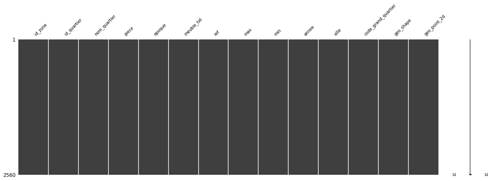
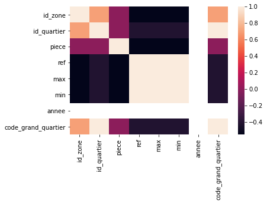
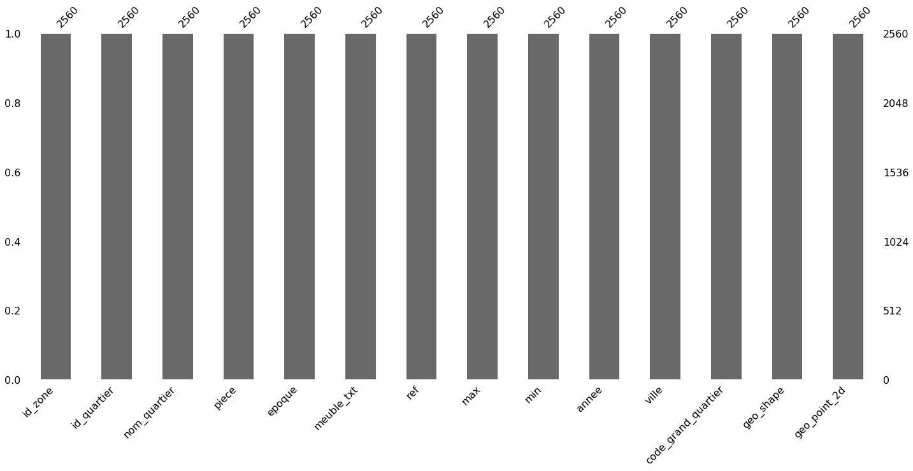
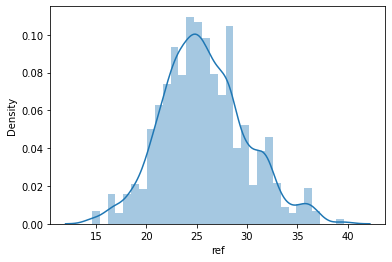
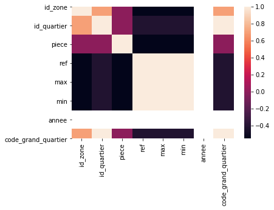
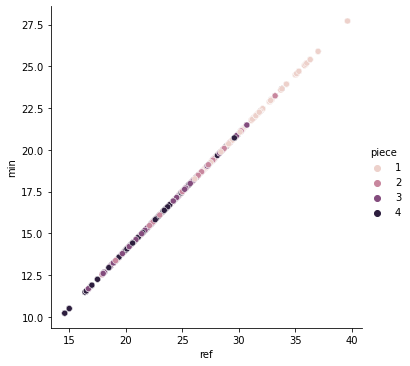
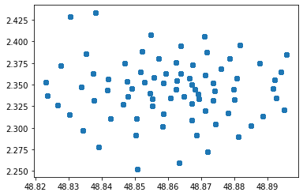

```python
import pandas as pd
import numpy as np
import seaborn as sns
import missingno as mno
import matplotlib.pyplot as plt
```


```python
df = pd.read_csv('./data/paris-real-estate.csv', sep=';')
```

# Understand the data


```python
# Show the fisrt 2 row of the dataset
df.head(2)
```


<div>
<style scoped>
    .dataframe tbody tr th:only-of-type {
        vertical-align: middle;
    }

    .dataframe tbody tr th {
        vertical-align: top;
    }

    .dataframe thead th {
        text-align: right;
    }
</style>
<table border="1" class="dataframe">
  <thead>
    <tr style="text-align: right;">
      <th></th>
      <th>id_zone</th>
      <th>id_quartier</th>
      <th>nom_quartier</th>
      <th>piece</th>
      <th>epoque</th>
      <th>meuble_txt</th>
      <th>ref</th>
      <th>max</th>
      <th>min</th>
      <th>annee</th>
      <th>ville</th>
      <th>code_grand_quartier</th>
      <th>geo_shape</th>
      <th>geo_point_2d</th>
    </tr>
  </thead>
  <tbody>
    <tr>
      <th>0</th>
      <td>13</td>
      <td>75</td>
      <td>Amérique</td>
      <td>4</td>
      <td>1946-1970</td>
      <td>non meublé</td>
      <td>14.6</td>
      <td>17.52</td>
      <td>10.22</td>
      <td>2020</td>
      <td>PARIS</td>
      <td>7511975</td>
      <td>{"type": "Polygon", "coordinates": [[[2.409402...</td>
      <td>48.8816381673,2.39544016662</td>
    </tr>
    <tr>
      <th>1</th>
      <td>13</td>
      <td>74</td>
      <td>Pont-de-Flandre</td>
      <td>4</td>
      <td>Apres 1990</td>
      <td>meublé</td>
      <td>18.5</td>
      <td>22.20</td>
      <td>12.95</td>
      <td>2020</td>
      <td>PARIS</td>
      <td>7511974</td>
      <td>{"type": "Polygon", "coordinates": [[[2.384878...</td>
      <td>48.8955557746,2.38477722927</td>
    </tr>
  </tbody>
</table>
</div>


```python
# Show the shape of the dataset (nb of row, nb of column)
df.shape
```


    (2560, 14)


```python
# quick synthesis
print('Number of row       : ', df.shape[0])
print()
print('Number of columns   : ', df.shape[1])
print()
print('Features            : \n', df.columns.tolist())
print()
print('Missing values      : \n', df.isnull().sum())
print()
print('Unique values       : \n', df.nunique())
print()
print('Total missing values:', df.isnull().values.sum())
```

    Number of row       :  2560
    
    Number of columns   :  14
    
    Features            : 
     ['id_zone', 'id_quartier', 'nom_quartier', 'piece', 'epoque', 'meuble_txt', 'ref', 'max', 'min', 'annee', 'ville', 'code_grand_quartier', 'geo_shape', 'geo_point_2d']
    
    Missing values      : 
     id_zone                0
    id_quartier            0
    nom_quartier           0
    piece                  0
    epoque                 0
    meuble_txt             0
    ref                    0
    max                    0
    min                    0
    annee                  0
    ville                  0
    code_grand_quartier    0
    geo_shape              0
    geo_point_2d           0
    dtype: int64
    
    Unique values       : 
     id_zone                 14
    id_quartier             80
    nom_quartier            80
    piece                    4
    epoque                   4
    meuble_txt               2
    ref                    152
    max                    152
    min                    152
    annee                    1
    ville                    1
    code_grand_quartier     80
    geo_shape               80
    geo_point_2d            80
    dtype: int64
    
    Total missing values: 0


```python
# More info on the specific unique values in a column
df['epoque'].unique().tolist()
```


    ['1946-1970', 'Apres 1990', '1971-1990', 'Avant 1946']


```python
# Quick stats on your dataset
df.describe().T
```


<div>
<style scoped>
    .dataframe tbody tr th:only-of-type {
        vertical-align: middle;
    }

    .dataframe tbody tr th {
        vertical-align: top;
    }

    .dataframe thead th {
        text-align: right;
    }
</style>
<table border="1" class="dataframe">
  <thead>
    <tr style="text-align: right;">
      <th></th>
      <th>count</th>
      <th>mean</th>
      <th>std</th>
      <th>min</th>
      <th>25%</th>
      <th>50%</th>
      <th>75%</th>
      <th>max</th>
    </tr>
  </thead>
  <tbody>
    <tr>
      <th>id_zone</th>
      <td>2560.0</td>
      <td>6.662500e+00</td>
      <td>4.225585</td>
      <td>1.00</td>
      <td>3.00</td>
      <td>5.00</td>
      <td>11.00</td>
      <td>14.00</td>
    </tr>
    <tr>
      <th>id_quartier</th>
      <td>2560.0</td>
      <td>4.050000e+01</td>
      <td>23.096718</td>
      <td>1.00</td>
      <td>20.75</td>
      <td>40.50</td>
      <td>60.25</td>
      <td>80.00</td>
    </tr>
    <tr>
      <th>piece</th>
      <td>2560.0</td>
      <td>2.500000e+00</td>
      <td>1.118252</td>
      <td>1.00</td>
      <td>1.75</td>
      <td>2.50</td>
      <td>3.25</td>
      <td>4.00</td>
    </tr>
    <tr>
      <th>ref</th>
      <td>2560.0</td>
      <td>2.572723e+01</td>
      <td>4.181951</td>
      <td>14.60</td>
      <td>22.90</td>
      <td>25.30</td>
      <td>28.30</td>
      <td>39.60</td>
    </tr>
    <tr>
      <th>max</th>
      <td>2560.0</td>
      <td>3.087267e+01</td>
      <td>5.018341</td>
      <td>17.52</td>
      <td>27.48</td>
      <td>30.36</td>
      <td>33.96</td>
      <td>47.52</td>
    </tr>
    <tr>
      <th>min</th>
      <td>2560.0</td>
      <td>1.800906e+01</td>
      <td>2.927365</td>
      <td>10.22</td>
      <td>16.03</td>
      <td>17.71</td>
      <td>19.81</td>
      <td>27.72</td>
    </tr>
    <tr>
      <th>annee</th>
      <td>2560.0</td>
      <td>2.020000e+03</td>
      <td>0.000000</td>
      <td>2020.00</td>
      <td>2020.00</td>
      <td>2020.00</td>
      <td>2020.00</td>
      <td>2020.00</td>
    </tr>
    <tr>
      <th>code_grand_quartier</th>
      <td>2560.0</td>
      <td>7.511090e+06</td>
      <td>599.811459</td>
      <td>7510101.00</td>
      <td>7510595.75</td>
      <td>7511090.50</td>
      <td>7511585.25</td>
      <td>7512080.00</td>
    </tr>
  </tbody>
</table>
</div>


```python
# Quick info about the dataset
df.info()
```

    <class 'pandas.core.frame.DataFrame'>
    RangeIndex: 2560 entries, 0 to 2559
    Data columns (total 14 columns):
     #   Column               Non-Null Count  Dtype  
    ---  ------               --------------  -----  
     0   id_zone              2560 non-null   int64  
     1   id_quartier          2560 non-null   int64  
     2   nom_quartier         2560 non-null   object 
     3   piece                2560 non-null   int64  
     4   epoque               2560 non-null   object 
     5   meuble_txt           2560 non-null   object 
     6   ref                  2560 non-null   float64
     7   max                  2560 non-null   float64
     8   min                  2560 non-null   float64
     9   annee                2560 non-null   int64  
     10  ville                2560 non-null   object 
     11  code_grand_quartier  2560 non-null   int64  
     12  geo_shape            2560 non-null   object 
     13  geo_point_2d         2560 non-null   object 
    dtypes: float64(3), int64(5), object(6)
    memory usage: 280.1+ KB


```python
# Quickly visually pick out patterns in data completion
mno.matrix(df, figsize = (20, 6), fontsize=10)
```


    <AxesSubplot:>


    

    


```python
# A simple visualization of nullity by column
mno.bar(df)
```


    <AxesSubplot:>


    

    


# Relationship analysis 


```python
# Correlation matrix
sns.heatmap(df.corr())
```


    <AxesSubplot:>


    

    


```python
# Plot pairwise relationships in a dataset
sns.pairplot(df)
```


    <seaborn.axisgrid.PairGrid at 0x7f9e64aa5160>


    

    


```python
# Plot data and a linear regression model fit
sns.regplot(x='ref', y='max', data=df)
```


    <AxesSubplot:xlabel='ref', ylabel='max'>


    

    


```python
sns.distplot(df['ref'])
```

    /Library/Frameworks/Python.framework/Versions/3.8/lib/python3.8/site-packages/seaborn/distributions.py:2551: FutureWarning: `distplot` is a deprecated function and will be removed in a future version. Please adapt your code to use either `displot` (a figure-level function with similar flexibility) or `histplot` (an axes-level function for histograms).
      warnings.warn(msg, FutureWarning)


    <AxesSubplot:xlabel='ref', ylabel='Density'>


    

    


```python
sns.catplot(x='ref', kind='box', data=df)
```


    <seaborn.axisgrid.FacetGrid at 0x7f9e5119d880>


    

    


```python
# Draw a plot of two variables with bivariate and univariate graphs
sns.jointplot(x='ref',y='piece', data=df, color='red', kind='kde');
```


    

    


```python
# Processed the geo points

# Create a column for the longitude and latitude
new_col = pd.DataFrame(df['geo_point_2d'].str.split(',',1).tolist(), columns = ['lat', 'lon'])

# Change the type to float
df['lat'] = new_col['lat'].astype(float)
df['lon'] = new_col['lon'].astype(float)

x = df['lat']
y = df['lon']

# Show I 
plt.scatter(x, y)
plt.show()
```


    

    


```python

```
